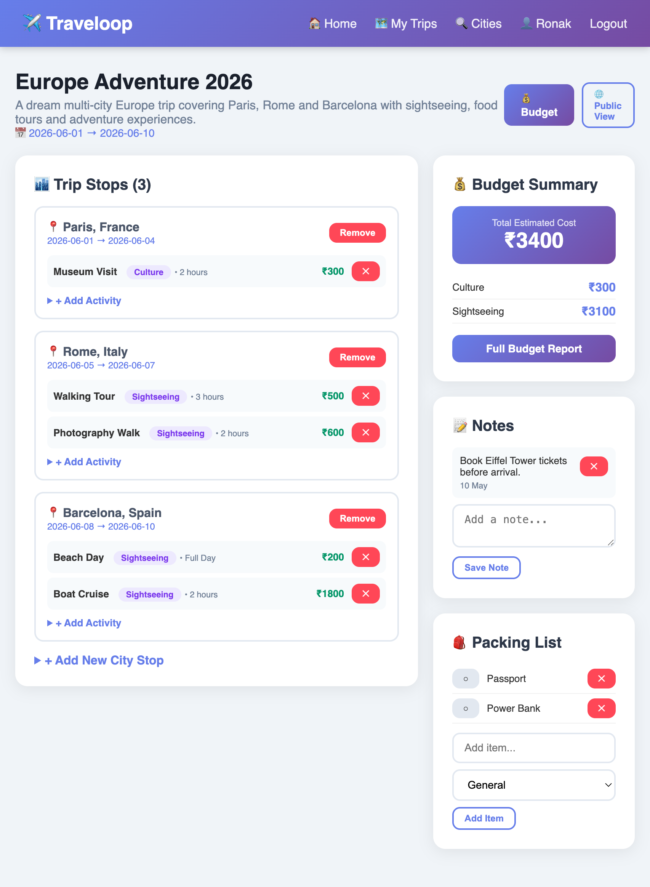
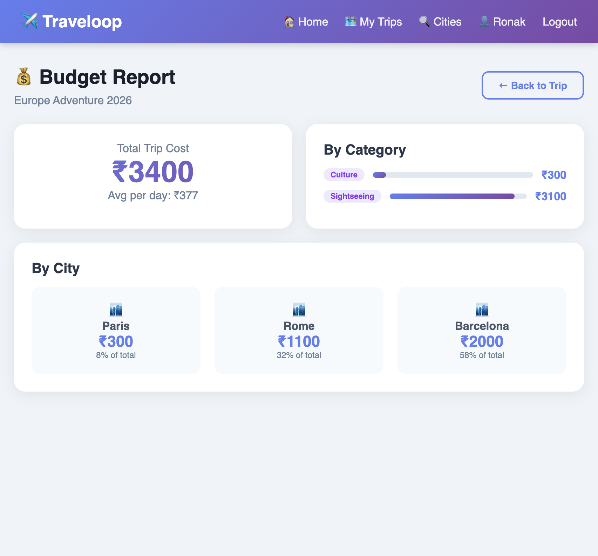
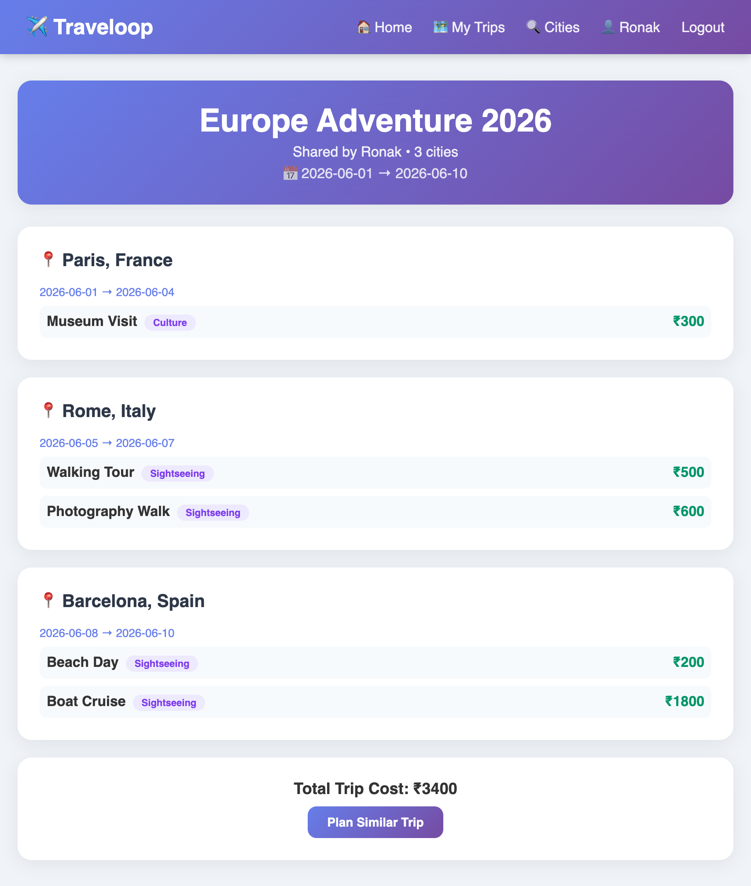

# Traveloop ✈️ - Personalized Travel Planning Made Easy

A full-stack travel planning web application built with Python Flask for the Odoo x Parul University Hackathon 2026.

---

## 🌟 Features

- User Authentication (Signup/Login)
- Multi-city Trip Itinerary Builder
- Activity Management with Cost Tracking
- Budget Breakdown by Category and City
- Packing Checklist
- Trip Notes / Journal
- City & Activity Search
- Public Itinerary Sharing
- Responsive Dashboard UI
- Budget Summary Report

---

## 🛠 Tech Stack

### Backend
- Python 3.11
- Flask
- SQLAlchemy
- Flask-Login

### Frontend
- HTML5
- CSS3
- Jinja2 Templates

### Database
- SQLite

---

## 🚀 Setup Instructions

### Clone Repository

```bash
git clone https://github.com/Ronakmsd/traveloop.git
cd traveloop
```

### Install Dependencies

```bash
pip3 install flask flask-sqlalchemy flask-login werkzeug
```

### Run Application

```bash
python3 app.py
```

Open in browser:

```bash
http://127.0.0.1:5000
```

---

## 📸 Project Screenshots

### Dashboard / Trip Overview



---

### Budget Breakdown



---

### Public Itinerary Sharing



---

## 🎯 Project Highlights

- Clean and modern UI
- Real-world travel planning workflow
- Public sharing support
- Budget management system
- Multi-city itinerary support
- Beginner-friendly architecture

---

## 👨‍💻 Team

- Ronak Bhanushali (Leader)
- Viraj Pravin Chauhan

---

## 📌 Future Improvements

- AI-based travel recommendations
- Google Maps integration
- Expense analytics charts
- Export trip as PDF
- Weather API integration

---

## 📄 License

This project is created for educational and hackathon purposes.
